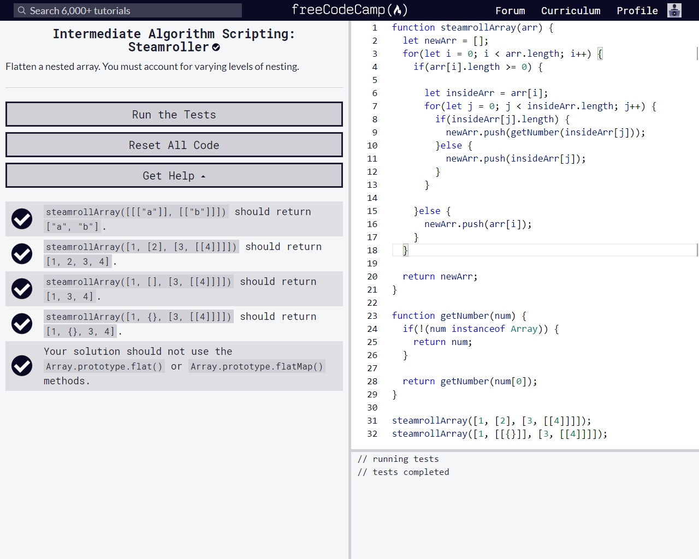

## Freecodecamp Algorithm Scripting Challenges
 
 

### Sum All Odd Fibonacci Numbers
[source](Sum%20All%20Odd%20Fibonacci%20Numbers.js)

 

### Sum All Primes
[source](Sum%20All%20Primes.js)

 

### Smallest Common Multiple
[source](Smallest%20Common%20Multiple.js)

 

### Drop it
[source](Drop%20It.js)

 

### Steamroller
[source](Steamroller.js)

 

### Binary Agents
[source](Binary%20Agents.js)

 

### Everything Be True
[source](Everything%20Be%20True.js)

